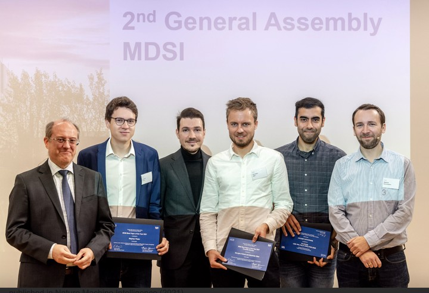

Proud that our paper on life-long and transfer learning for single-cell biology has been awarded among top 3 papers selected by anonymous reviewers from [MDSI](https://www.mdsi.tum.de/en/mdsi/latest-info/news/full-text/article/awardees-of-the-mdsi-best-paper-of-the-year-award/) at Technical University of Munich.
This was among the work done during my doctoral studies at Helmholtz Munich and Life science school at TUM.

About the paper:

**Mapping single-cell data to reference atlases by transfer learning**

<u>Lotfollahi, M.</u>, Naghipourfar, M., Luecken, M. D., Khajavi, M., Büttner, M., Wagenstetter, M., Avsec, Ž., Gayoso, A., Yosef, N., Interlandi, M. & Others.

[[Nature Biotechnology (2022)]](https://www.nature.com/articles/s41587-021-01001-7),
[[code]](https://github.com/theislab/scarches),
[[MDSI best paper award]](https://www.mdsi.tum.de/en/mdsi/latest-info/news/full-text/article/awardees-of-the-mdsi-best-paper-of-the-year-award/),
[[featured cover in Nature Biotechnology]](https://www.nature.com/nbt/volumes/40/issues/1).
