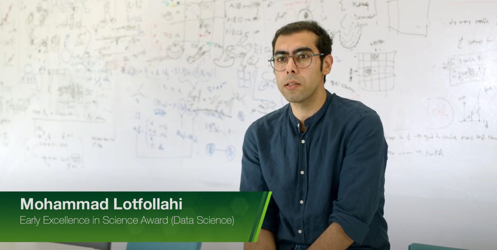

I am greatly honored by [Bayer Foundation](https://www.helmholtz-munich.de/en/newsroom/news-all/artikel/interpreting-biological-data-mohammad-lotfollahi-wins-early-excellence-in-science-award-2022)
by awarding me the "Early Excellence in Science Award" and recognizing my work on "developing machine learning algorithms to understand large-scale single-cell omics data in health and disease to
ultimately facilitate the advancement of precision medicine and AI-assisted drug discovery." Big thanks to my family, previous and current collaborators, and mentors.

#### Watch the award video here (click in the image)

[[**Award Ceremony**](https://youtu.be/xwZ9otXpoEk),
[[**Read about the award**]](https://www.helmholtz-munich.de/en/newsroom/news-all/artikel/interpreting-biological-data-mohammad-lotfollahi-wins-early-excellence-in-science-award-2022).

