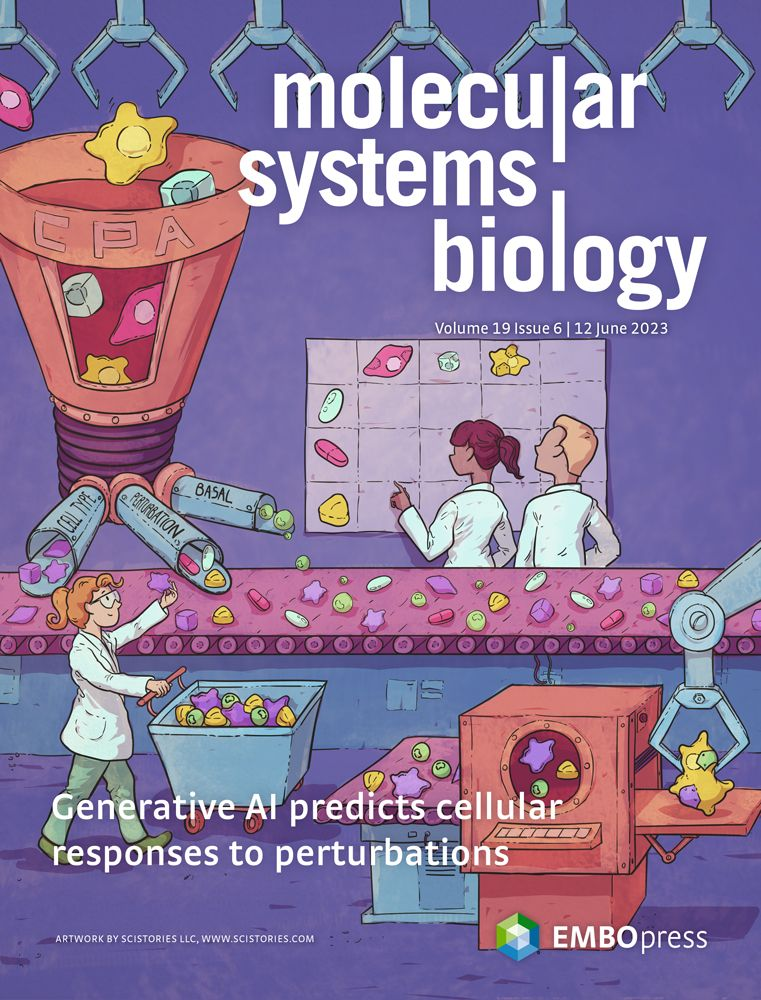

I am excited that our work from my time at Meta AI and collaboration with Helmholtz Munich on modeling single-cell perturbations (e.g., drugs, disease, CRISPR manipulations) is now featured on the cover of Molecular systems biology. 
Thanks to all collaborators and my co-authors for making this happen.

About the paper:

<u>Lotfollahi, M+.</u>, Klimovskaia Susmelj+, A., De Donno, C+., Hetzel, L., Ji, Y., Ibarra, I. L., ... & Theis, F. J.

[[Molecular Systems Biology (2023)]](https://www.embopress.org/doi/full/10.15252/msb.202211517),
[[code]](https://github.com/facebookresearch/CPA),
[[Facebook AI blogpost]](https://ai.facebook.com/blog/ai-predicts-effective-drug-combinations-to-fight-complex-diseases-faster),
[[state of AI report 2021]](https://www.stateof.ai/2021),
[[featured cover]](https://www.embopress.org/loi/17444292).