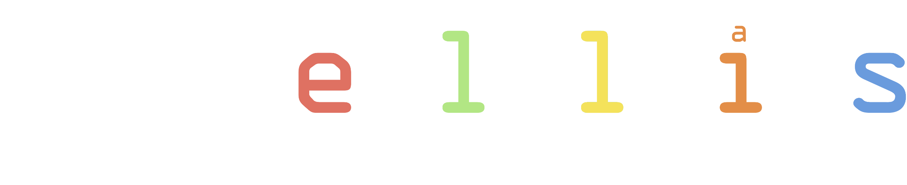

I am excited to join **[ELLIS - the European Laboratory for Learning and Intelligent Systems](https://ellis.eu/)**.
Very grateful to fellows who supported me. 

About ELLIS: 
> ELLIS is a pan-European AI network of excellence which focuses on fundamental science, technical innovation and societal impact. Founded in 2018, ELLIS builds upon machine learning as the driver for modern AI and aims to secure Europe’s sovereignty in this competitive field by creating a multi-centric AI research laboratory. ELLIS wants to ensure that the highest level of AI research is performed in the open societies of
> Europe and follows a three-pillar strategy to achieve that.

